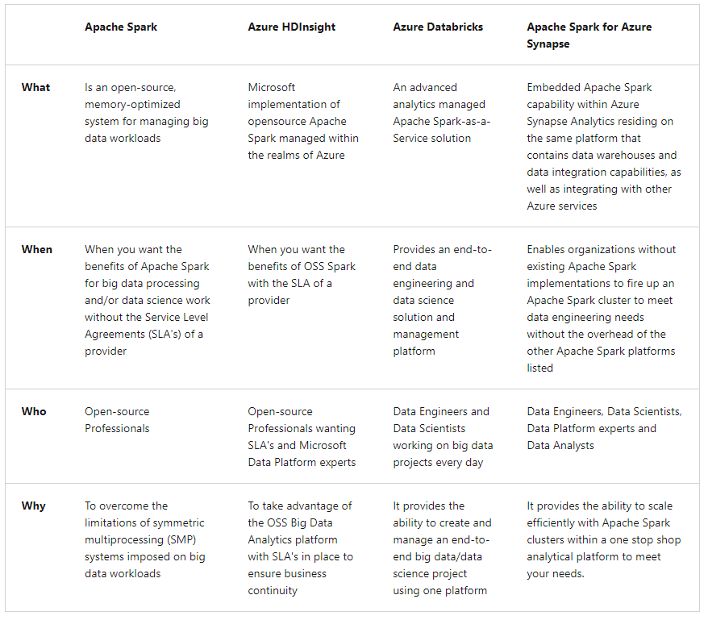
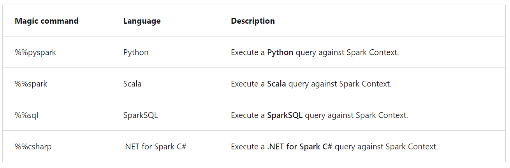

# Perform data engineering with Azure Synapse Apache Spark Pools

To perform data engineering with Azure Synapse Apache Spark Pools, which enable you to boost the performance of big-data analytic applications by in-memory cluster computing.

## Understand big data engineering with Apache Spark in Azure Synapse

To differentiate between Apache Spark, Azure Databricks, HDInsight, and SQL Pools, as well as understanding the use-cases of data-engineering with Apache Spark in Azure Synapse Analytics.

* When do you use Apache Spark pools in Azure Synapse Analytics

With the variety of Apache Spark data services that are available on Azure, the following table outlines where Azure Synapse Analytics Apache Spark pools fit in the ecosystem.

##  Ingest data with Apache Spark notebooks in Azure Synapse Analytics

Notebooks also enable you to write multiple languages in one notebook by using the magic commands expressed by using the %%<Name of Language> syntax. As a result you could create a temporary table to store ingested data within the notebook, and then use the magic command to enable multiple languages to work with this data.

*   With an Azure Synapse Studio notebook, you can:

    *   Get started with zero setup effort.
  
    *   Keep data secure with built-in enterprise security features.
  
    *   Analyze data across raw formats (CSV, txt, JSON, etc.), processed file formats (parquet, Delta Lake, ORC, etc.), and SQL tabular data files against Apache Spark and SQL.
  
    *   Be productive with enhanced authoring capabilities and built-in data visualization.
  
*   There are various use cases that make using notebooks compelling within Azure Synapse Analytics   
   
    *   To perform exploratory data analysis using a familiar paradigm
   
    *   To integrate notebooks as part of a broader data transformation process
   
    *   You wish to perform advanced analytics using notebooks with Azure Machine Learning Services

###  Create a Spark Notebook in Azure Synapse Analytics
   
*   Exercise: Create a spark notebook in Azure Synapse Analytics
   
    *    In the Azure portal, navigate to the Azure Synapse workspace you want to use, and select Open Synapse Studio.
   
    *    Once the Azure Synapse Studio has launched, select Develop.
   
    *    From there, select the "+" icon, and then select Notebook. A new notebook is created and opened with an automatically generated name.
   
    *    In the Properties window, provide a name for the notebook. On the toolbar, select Publish.
   
    --Note: Add code by using the "+" icon or the "+ Cell" icon and select Code cell to input code or Markdown cell to input markdown content. When adding a code cell, the default language is PySpark. In the code cell below, you are going to use Pyspark. However, other supported languages are Scala, SQL, and .NET for Spark.
   
   `new_rows = [('CA',22, 45000),("WA",35,65000) ,("WA",50,85000)]`
   
   `demo_df = spark.createDataFrame(new_rows, ['state', 'age', 'salary'])`
   
   `demo_df.show()`
   
   --When you want to run a cell, you can use the following methods: 
   Press SHIFT + ENTER.
   Select the blue play icon to the left of the cell.
   Select the Run all button on the toolbar.
   
*  Azure Synapse Analytics Spark pools support various languages. The primary languages available within the notebook environment are: PySpark (Python), Spark (Scala), .NET Spark (C#), Spark SQL
   
   It is possible to use multiple languages in one notebook by specifying the language using a magic command at the beginning of a cell. The following table lists the magic commands to switch cell languages:
   
   
   
   --Note: You cannot reference data or variables directly using different languages in an Azure Synapse Studio notebook. If you wish to do this using Spark, you first create a temporary table so that it can be referenced across different languages. Here is an example of how to read a `Scala` DataFrame in `PySpark` and `SparkSQL` using a Spark temp table as a workaround. The following code shows you how to read a DataFrame from a SQL pool connector using Scala. It also shows how you can create a temporary table.
   
   `%%spark`
   
   `val scalaDataFrame = spark.read.sqlanalytics("mySQLPoolDatabase.dbo.mySQLPoolTable")`
   
   `scalaDataFrame.createOrReplaceTempView( "mydataframetable" )`
   
   --If you want to query the DataFrame in the above example, using Spark SQL, you can add a code cell below the code snippet above, and use the %%sql command. Using the %%sql command enables you to use a SQL statement such as shown below where you would select everything from the 'mydataframetable'.
   
   `%%sql`
   
   `SELECT * FROM mydataframetable`
   
   --If you want to use the data in PySpark, below an example is given using the magic command %%pyspark, in which you create a new Python DataFrame based on the mydataframe table whilst using spark.sql to select everything from that table.
   
   `%%pyspark`
   
   `myNewPythonDataFrame = spark.sql("SELECT * FROM mydataframetable")`
   
   --You can use familiar Jupyter magic commands in Azure Synapse Studio notebooks. Review the following list as the current available magic commands: 
   
   Available line magics: %lsmagic, %time, %time it

   Available cell magics: %%time, %%timeit, %%capture, %%writefile, %%sql, %%pyspark, %%spark, %%csharp
   
### Develop/Run/Load data/Save Spark Notebooks

*  To develop solutions in a notebook, you work with cells. Cells are individual blocks of code or text that can be run independently or as a group. There are a range of actions that can be performed against a cell including:
   *  Move a cell.
   *  Delete a cell.
   *  Collapse Cell in and output.
   *  Undo Cell operations.

*  Run spark notebooks
   *  Run a Cell
   *  Run all cells
   *  Cancel a running cell
   *  Cell Status indicator
   *  Spark progress indicator
   *  Spark session config
   
*  Load data in spark notebooks
   In order to ingest data into a notebook, there are several options. Currently it is possible to load data from an Azure Storage Account, and an Azure Synapse Analytics dedicated SQL pool.

   *  Some examples for reading data in a notebook are:
         --Read a CSV from Azure Data Lake Store Gen2 as an Apache Spark DataFrame
         --Read a CSV from Azure Storage Account as an Apache Spark DataFrame
         --Read data from the primary storage account
   
   *  Example 1: Read a CSV file from an Azure Data Lake Store Gen2 store as an Apache Spark DataFrame.
   *  Example 2: Read a CSV file from Azure Storage Account as a Spark DataFrame.
   *  Example 3: Read data from the primary storage account
   *  Example 4: Ingest and explore Parquet files from a data lake with Apache Spark for Azure Synapse
   
   *  By using the Data hub to view the Parquet files in the connected storage account, then use the new notebook context menu to create a new Synapse notebook that loads a Spark DataFrame with the contents of a selected Parquet file.
   
   *  Add the following code beneath the code in the cell to define a variable named datalake whose value is the name of the primary storage account (replace the REPLACE_WITH_YOUR_DATALAKE_NAME value with the name of the storage account in line 2): `datalake = 'REPLACE_WITH_YOUR_DATALAKE_NAME'`
   
   *  By default, the cell outputs to a table view when we use the `display()` function. Let's select the Chart visualization to see a different view of the data.
   
   *  The Apache Spark engine can analyze the Parquet files and infer the schema. To do so, enter the below code in the new cell and run it: `data_path.printSchema()`
   
   --Note: Apache Spark evaluates the file contents to infer the schema. This automatic inference is sufficient for data exploration and most transformation tasks. However, when you load data to an external resource like a SQL pool table, sometimes you need to declare your own schema and apply that to the dataset. For now, the schema looks good.
   
   <a href="./loadinnotebook.py">Examples</a>

*  Save spark notebooks

   When you have finished with your work in the notebooks, it is possible to save a single notebook or all of notebooks that you've created within Azure Synapse Studio notebooks.

   *  To save changes you made to a single notebook, select the Publish button on the notebook command bar.
   *  To save all notebooks in your workspace, select the Publish all button on the workspace command bar.
   *  In the notebook properties, you can configure whether to include the cell output when saving.
   
   
##  Transform data with DataFrames in Apache Spark Pools in Azure Synapse Analytics

DataFrames are a collection of data organized into named columns. DataFrames enable Apache Spark to understand the schema of the data, and optimize any execution plans on queries that will access the data held in the DataFrame. DataFrames are designed to process a large volume of data from a wide variety of data sources from structured data sources through to Resilient Distributed Datasets (RDDs) in either a batch or streaming data architecture. In short, DataFrames are to Apache Spark, what tables are to relational databases.
   
*  The first step is to construct a DataFrame. You can create a DataFrame and populate it with data at execution time as shown in the above example:   
*  However, it is more common to ingest data from a data source such as a file into a DataFrame as shown in the next example:
   
   `from azureml.opendatasets import NycTlcYellow`

   `data = NycTlcYellow()`
   
   `data_df = data.to_spark_dataframe()`
   
   `display(data_df.limit(10))`
   
   --Once you're at the stage where you have populated a DataFrame with data, you manipulate the data stored in a DataFrame. The manipulation of data can be done with User Defined Functions (UDFs) that are column-based and help you transform and manipulate the data stored in a DataFrame.
   
###   Load data into a Spark DataFrame
   
*  You can load data into an Apache Spark DataFrame from different file types stored in an Azure Storage Account, or from data stored in a dedicated SQL pool. Some <a href="./loadinnotebook.py">Examples</a> of loading data are:

   *  Read a CSV from Azure Data Lake Store Gen2 as an Apache Spark DataFrame
   *  Read a CSV from Azure Storage Account as an Apache Spark DataFrame
   *  Read data from the primary storage account
   
   `%%spark`
   
   `spark.sql("CREATE DATABASE IF NOT EXISTS nyctaxi")`
   
   `val df = spark.read.sqlanalytics("SQLPOOL1.dbo.Trip") `
   
   `df.write.mode("overwrite").saveAsTable("nyctaxi.trip")`
   
   --In this code example, the spark.sql method is used to create a database named nyctaxi. A DataFrame named df reads data from a table named Trip in the SQLPOOL1 dedicated SQL pool instance. Finally, the DataFrame df writes data into it and used the saveAsTable method to save it as nyctaxi.trip.
   
   
###   Flatten nested structures and explode arrays with Apache Spark
   
A common use case for using Apache Spark pools in Azure Synapse Analytics is for transforming complex data structures using DataFrames. It can help for the following reasons:

*  Complex data types are increasingly common and represent a challenge for data engineers because analyzing nested schema and data arrays often include time-consuming and complex SQL queries.
   
*  It can be difficult to rename or cast the nested column data type.
   
*  Performance issues arise when working with deeply nested objects. Data Engineers need to understand how to efficiently process complex data types and make them easily accessible to everyone. In the following example, Apache Spark for Azure Synapse is used to read and transform objects into a flat structure through data frames.
   
*  Apache Synapse SQL serverless is used to query such objects directly and return those results as a regular table.

*  With Azure Synapse Apache Spark pools, it's easy to transform nested structures into columns and array elements into multiple rows.   

*  In the <a href="./loadinnotebook.py">Examples</a>, the following steps show the techniques involved to deal with complex data types by creating multiple DataFrames to achieve the desired result.
   
   *  Step 1: Define a function for flattening

   We create a function that will flatten the nested schema.

   *  Step 2: Flatten nested schema
   
   We will define the function you create to flatten the nested schema from one DataFrame into a new DataFrame.

   *  Step 3: Explode Arrays
   
   Here you will transform the data array from the DataFrame created in step 2 into a new DataFrame.

   *  Step 4: Flatten child nested Schema
   
   Finally, you use the transformed DataFrame created in step 3 and load the cleansed data into a destination DataFrame to complete the work.
   
   
   
##  Integrate SQL and Apache Spark pools in Azure Synapse Analytics

##  
