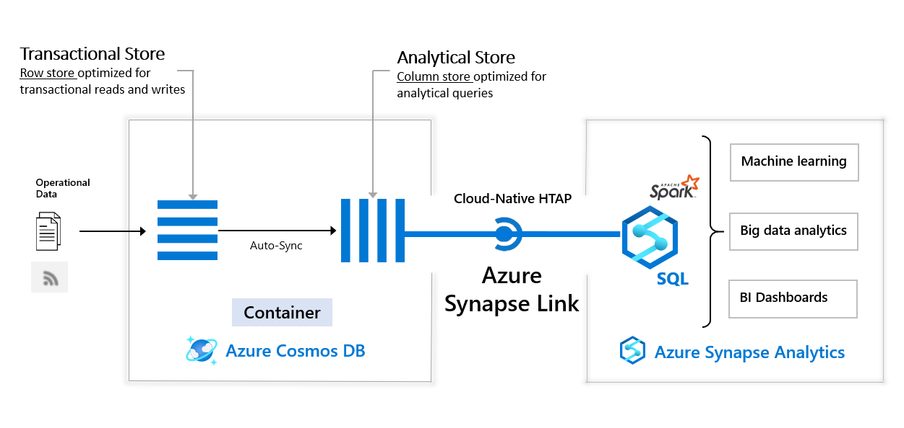

# Data Engineering with Azure Cosmos DB

Azure Cosmos DB is a globally distributed database system that allows you to read and write data from the local replicas of your database and it transparently replicates the data to all the regions associated with your Cosmos account. Azure Cosmos DB analytical store is a fully isolated column store for enabling large-scale analytics against operational data in your Azure Cosmos DB, without any impact to your transactional workloads.

* To implement partitions are organized in Azure Cosmos DB and how to choose an appropriate partition key for your solution.
* To develop client and server-side programming solutions on Azure Cosmos DB.

## Work with Hybrid Transactional and Analytical Processing Solutions using Azure Synapse Analytics

  To perform operational analytics against Azure Cosmos DB using the Azure Synapse Link feature within Azure Synapse Analytic and solves the issue of making operational data available for analytical query in near real time. 

###  Design hybrid transactional and analytical processing using Azure Synapse Analytics

* Many business application architectures separate transactional and analytical processing into separate systems with data stored and processed on separate infrastructures. These infrastructures are commonly referred to as OLTP (online transaction processing) systems working with operational data, and OLAP (online analytical processing) systems working with historical data, with each system is optimized for their specific task.

    *   OLTP systems are optimized for dealing with discrete system or user requests immediately and responding as quickly as possible.

    *   OLAP systems are optimized for the analytical processing, ingesting, synthesizing, and managing large sets of historical data. The data processed by OLAP systems largely originates from OLTP systems and needs to be loaded into the OLAP systems by means of batch processes commonly referred to as ETL (Extract, Transform, and Load) jobs.

* Due to their complexity and the need to physically copy large amounts of data, this creates a delay in data being available to provide insights by way of the OLAP systems.

* As more and more businesses move to digital processes, they increasingly recognize the value of being able to respond to opportunities by making faster and well-informed decisions. HTAP (Hybrid Transactional/Analytical processing) enables business to run advanced analytics in near-real-time on data stored and processed by OLTP systems.

* **Azure Synapse Link for Azure Cosmos DB**

  Azure Synapse Link for Azure Cosmos DB is a cloud-native HTAP capability that enables you to run near-real-time analytics over operational data stored in Azure Cosmos DB. Azure Synapse Link creates a tight seamless integration between Azure Cosmos DB and Azure Synapse Analytics.

    *   Azure Cosmos DB provides both a transactional store optimized for transactional workloads and an analytical store optimized for analytical workloads and a fully managed autosync process to keep the data within these stores in sync.

    *   Azure Synapse Analytics provides both a SQL Serverless query engine for querying the analytical store using familiar T-SQL and an Apache Spark query engine for leveraging the analytical store using your choice of Scala, Java, Python or SQL and provides a user-friendly notebook experience.

    *   Together Azure Cosmos DB and Synapse Analytics enable organizations to generate and consume insights from their operational data in near-real time, using the query and analytics tools of their choice. All of this is achieved without the need for complex ETL pipelines and without affecting the performance of their OLTP systems using Azure Cosmos DB.

    
    
* There are common use cases for using Azure Synapse Link for Azure Cosmos DB capability to address real-world business needs using operational analytics: 

    *   Supply chain analytics, forecasting and reporting.
    *   Retail real-time personalization.
    *   Predictive maintenance using anomaly detection with IOT
   
###  To configure and enable Azure Synapse Link to interact with Azure Cosmos DB. 

* Enable Cosmos DB account to use Azure Synapse Link

  Before we can create an Azure Cosmos DB container with an analytical store, we must first enable Azure Synapse Link on the Azure Cosmos DB account. Today you cannot disable the Synapse Link feature once it is enabled on the account, you cannot disable it. Enabling Synapse Link on the account has no billing implications until containers are created with the analytical store enabled.

* Enabling Synapse Link on Azure Cosmos DB SQL (Core) API account

  *   Navigate to the Azure portal and select the Azure Cosmos DB account.
  *   Navigate to your previously created Azure Cosmos DB SQL (Core) API account.
  *   Select Data Explorer in the left-hand menu (3)
  *   Then click Enable Azure Synapse Link button at the top of the screen (4)
  *   Then click Enable Azure Synapse Link on the pop-up dialog box.
  *   Select Features in the left-hand menu (1)
  *   Verify that the Azure Synapse Link feature shows with a Status of on (2), this will indicate that the Azure Cosmos DB account has been enabled for Azure Synapse Link.

* Enabling Synapse Link on Azure Cosmos DB API for MongoDB account

  *   Navigate to the Azure portal (https://portal.azure.com) and select the Azure Cosmos DB account.
  *   Navigate to your previously created Azure Cosmos DB API for MongoDB account.
  *   Select Features in the left-hand menu (3)
  *   Then click on the Azure Synapse Link entry in the features table (4).
  *   The click the Enable button on the dialog box on the right (5)

* Create an analytical store enabled container

  Before we can query our data using Azure Synapse Analytics using Azure Synapse Link, we must first create the container that is going to hold our data at the same time enabling it to have an analytical store.
  
  *   Create a new Azure Cosmos DB Core (SQL) API container
### To perform analytics against Azure Cosmos DB using Azure Synapse Link.

### To use the Synapse serverless SQL pools to query the Azure Cosmos DB data made available by Azure Synapse Link. 
