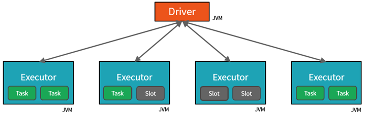
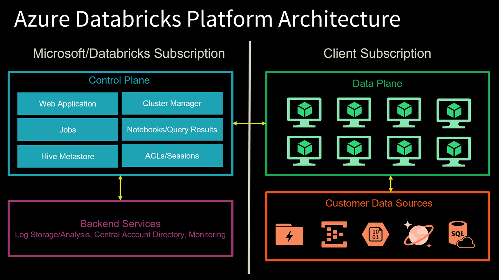
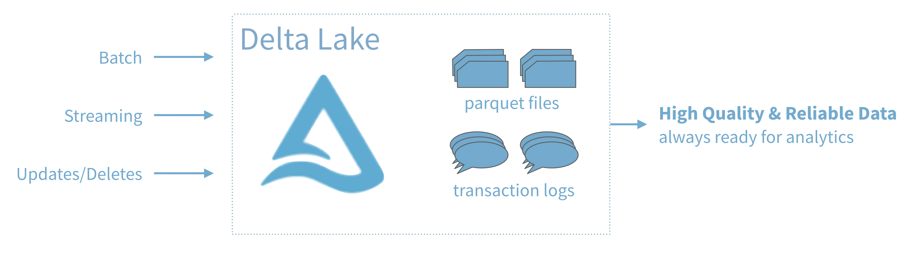
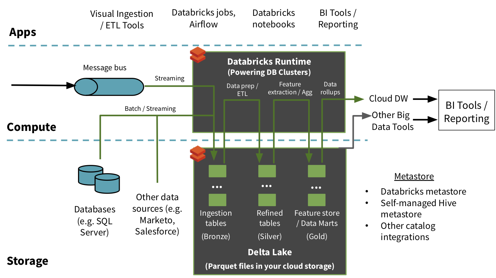

# Data engineering with Azure Databricks

To harness the power of Apache Spark and powerful clusters running on the Azure Databricks platform to run large data engineering workloads in the cloud. Databricks Data Science & Engineering provides an interactive workspace that enables collaboration between data engineers, data scientists, and machine learning engineers. For a big data pipeline, the data (raw or structured) is ingested into Azure through Azure Data Factory in batches, or streamed near real-time using Apache Kafka, Event Hub, or IoT Hub. This data lands in a data lake for long term persisted storage, in Azure Blob Storage or Azure Data Lake Storage. As part of your analytics workflow, use Azure Databricks to read data from multiple data sources and turn it into breakthrough insights using Spark.

 * <a href="#section1">Describe Azure Databricks</a>

 * <a href="#section2">Spark architecture fundamental</a>

 * <a href="#section3">Read and write data in Azure Databricks</a>

 * <a href="#section4">Work with DataFrames in Azure Databricks</a>

 * <a href="#section5">Describe lazy evaluation and other performance features in Azure Databricks</a>

 * <a href="#section6">Work with DataFrames columns in Azure Databricks</a>

 * <a href="#section7">Work with DataFrames advanced methods in Azure Databricks</a>

 * <a href="#section8">Describe platform architecture, security, and data protection in Azure Databricks</a>

 * <a href="#section9">Build and query a Delta Lake</a>

 * <a href="#section10">Process streaming data with Azure Databricks structured streaming</a>

 * <a href="#section11">Describe Azure Databricks Delta Lake architecture</a>

 * <a href="#section12">Create production workloads on Azure Databricks with Azure Data Factory</a>

 * <a href="#section13">Implement CI/CD with Azure DevOps</a>

 * <a href="#section14">Integrate Azure Databricks with Azure Synapse</a>

 * <a href="#section15">Describe Azure Databricks best practices</a>

 * <a href="#section16">Design a data integration and analytic solution with Azure Databricks</a>
 
 


<a href="https://docs.microsoft.com/en-us/azure/databricks/scenarios/databricks-extract-load-sql-data-warehouse">Tutorial: Extract, transform, and load data by using Azure Databricks</a>

  * Create an Azure Databricks service.
  * Create a Spark cluster in Azure Databricks.
  * Create a file system in the Data Lake Storage Gen2 account.
  * Upload sample data to the Azure Data Lake Storage Gen2 account.
  * Create a service principal.
  * Extract data from the Azure Data Lake Storage Gen2 account.
  * Transform data in Azure Databricks.
  * Load data into Azure Synapse.

##  <h2 id="section1">Describe Azure Databricks</h2>

Discover the capabilities of Azure Databricks and the Apache Spark notebook for processing huge files. Understand the Azure Databricks platform and identify the types of tasks well-suited for Apache Spark. Azure Databricks runs on top of a proprietary data processing engine called Databricks Runtime, an optimized version of Apache Spark. It allows up to 50x performance for Apache Spark workloads. Apache Spark is the core technology. Spark is an open-source analytics engine for large-scale data processing. It provides an interface for programming entire clusters with implicit data parallelism and fault tolerance. In a nutshell: Azure Databricks offers a fast, easy, and collaborative Spark based analytics service. It is used to accelerate big data analytics, artificial intelligence, performant data lakes, interactive data science, machine learning, and collaboration.

When talking about the Azure Databricks workspace, we refer to two different things. The first reference is the logical Azure Databricks environment in which clusters are created, data is stored (via DBFS), and in which the server resources are housed. The second reference is the more common one used within the context of Azure Databricks. That is the special root folder for all of your organization's Databricks assets, including notebooks, libraries, and dashboards. 

*  You can use Apache Spark notebooks to:

   *  Read and process huge files and data sets
   *  Query, explore, and visualize data sets
   *  Join disparate data sets found in data lakes
   *  Train and evaluate machine learning models
   *  Process live streams of data
   *  Perform analysis on large graph data sets and social networks

##  <h2 id="section2">Spark architecture fundamentals</h2>

Understand the architecture of an Azure Databricks Spark Cluster and Spark Jobs.

Azure Databricks provides a notebook-oriented Apache Spark as-a-service workspace environment. It is the most feature-rich hosted service available to run Spark workloads in Azure. Apache Spark is a unified analytics engine for large-scale data processing and machine learning. Suppose you work with Big Data as a data engineer or a data scientist, and you must process data that you can describe as having one or more of the following characteristics:

   *  High volume - You must process an extremely large volume of data and need to scale out your compute accordingly
   *  High velocity - You require streaming and real-time processing capabilities
   *  Variety - Your data types are varied, from structured relational data sets and financial transactions to unstructured data such as chat and SMS messages, IoT devices, images, logs, MRIs, etc.

These characteristics are oftentimes called the "3 Vs of Big Data". When it comes to working with Big Data in a unified way, whether you process it real time as it arrives or in batches, Apache Spark provides a fast and capable engine that also supports data science processes, like machine learning and advanced analytics.

In Databricks, the notebook interface is the driver program. This driver program contains the main loop for the program and creates distributed datasets on the cluster, then applies operations (transformations & actions) to those datasets. Driver programs access Apache Spark through a SparkSession object regardless of deployment location.


The unit of distribution is a Spark Cluster. Every Cluster has a Driver and one or more executors. Work submitted to the Cluster is split into as many independent Jobs as needed. This is how work is distributed across the Cluster's nodes. Jobs are further subdivided into tasks. The input to a job is partitioned into one or more partitions. These partitions are the unit of work for each slot. In between tasks, partitions may need to be re-organized and shared over the network.



Jobs & stages
  * Each parallelized action is referred to as a Job.
  * The results of each Job (parallelized/distributed action) is returned to the Driver.
  * Depending on the work required, multiple Jobs will be required.
  * Each Job is broken down into Stages.
  * This would be analogous to building a house (the job)
  * The first stage would be to lay the foundation.
  * The second stage would be to erect the walls.
  * The third stage would be to add the room.
  * Attempting to do any of these steps out of order just won't make sense, if not just impossible.

From a developer's and learner's perspective my primary focus is on...
  * The number of Partitions my data is divided into.
  * The number of Slots I have for parallel execution.
  * How many Jobs am I triggering?
  * And lastly the Stages those jobs are divided into.


##  <h2 id="section3">Read and write data in Azure Databricks</h2>

Work with large amounts of data from multiple sources in different raw formats. Azure Databricks supports day-to-day data-handling functions, such as reads, writes, and queries.

* Using Spark to load table/file/DBFS data

    *  We can use Spark to load the table data by using the sql method with Python:
    `df = spark.sql("SELECT * FROM nyc_taxi_csv")`

    *  We can also read the data from the original files we've uploaded; or indeed from any other file available in the DBFS. The code is the same regardless of whether a file is local or in remote storage that was mounted, thanks to DBFS mountpoints (Python). Spark supports many different data formats, such as CSV, JSON, XML, Parquet, Avro, ORC and more.
    
    `df = spark.read.csv('dbfs:/FileStore/tables/nyc_taxi.csv', header=True, inferSchema=True)`
    
* DataFrame size/structure/contents
      
    *  To get the number of rows available in a DataFrame, we can use the count() method.
    
    `df.count`
    
    *  To get the schema metadata for a given DataFrame, we can use the printSchema() method. Each column in a given DataFrame has a name, a type, and a nullable flag.
    
    `df.printSchema`
    
   *  Spark has a built-in function that allows to print the rows inside a DataFrame: show()
   
    `df.show`
    
     `df.show(100, truncate=False) #show more lines, do not truncate`
     
     By default it will only show the first 20 lines in your DataFrame and it will truncate long columns. Additional parameters are available to override these settings.
     
* Query dataframes
  DataFrames allow the processing of huge amounts of data. Spark uses an optimization engine to generate logical queries. Data is distributed over your cluster and you get huge performance for massive amounts of data. Spark SQL is a component that introduced the DataFrames, which provides support for structured and semi-structured data. Spark has multiple interfaces (APIs) for dealing with DataFrames: 
   *  We have seen the .sql() method, which allows to run arbitrary SQL queries on table data. 
   *  Another option is to use the Spark domain-specific language for structured data manipulation, available in Scala, Java, Python, and R.
    
* Complete the following notebook: 
  *  Start working with the API documentation
  *  Introduce the class SparkSession and other entry points
  *  Introduce the class DataFrameReader
  *  Read data from: CSV without a Schema, CSV with a Schema
  *  Read data from: JSON without a Schema, JSON with a Schema
  *  Read data from: Parquet files without a schema, Parquet files with a schema
  *  Read data from tables/views, Write data to a Parquet file, Read the Parquet file back and display the results
  *  <a href="./notebook/Read Write Query with DataFrame.ipynb">Examples</a>

##  <h2 id="section4">Work with DataFrames in Azure Databricks</h4>

Your data processing in Azure Databricks is accomplished by defining DataFrames to read and process the Data. Learn how to perform data transformations in DataFrames and execute actions to display the transformed data.

Spark uses 3 different APIs: RDDs, DataFrames, and DataSets. The architectural foundation is the resilient distributed dataset (RDD). The DataFrame API was released as an abstraction on top of the RDD, followed later by the Dataset API. We'll only use DataFrames in our notebook examples. DataFrames are the distributed collections of data, organized into rows and columns. Each column in a DataFrame has a name and an associated type. Spark DataFrames can be created from various sources, such as CSV files, JSON, Parquet files, Hive tables, log tables, and external databases.

 * Use the count() method to count rows in a DataFrame
 * Use the display() function to display a DataFrame in the Notebook
 * Cache a DataFrame for quicker operations if the data is needed a second time
 * Use the limit function to display a small set of rows from a larger DataFrame
 * Use select() to select a subset of columns from a DataFrame
 * Use distinct() and dropDuplicates to remove duplicate data
 * Use drop() to remove columns from a DataFrame
 * <a href="./notebook/Working with DataFrames.ipynb">Examples</a>


##  <h2 id="section5">Describe lazy evaluation and other performance features in Azure Databricks</h2>

Understand the difference between a transform and an action, lazy and eager evaluations, Wide and Narrow transformations, and other optimizations in Azure Databricks.

Fundamental to Apache Spark are the notions that
* Transformations are **LAZY**
* Actions are **EAGER**

The following code condenses the logic from the DataFrames modules in this learning path, and uses the DataFrames API to:
- Specify a schema, format, and file source for the data to be loaded
- Select columns to `GROUP BY`
- Aggregate with a `COUNT`
- Provide an alias name for the aggregate output
- Specify a column to sort on

This cell defines a series of **transformations**. By definition, this logic will result in a DataFrame and will not trigger any jobs.

`schemaDDL = "NAME STRING, STATION STRING, LATITUDE FLOAT, LONGITUDE FLOAT, ELEVATION FLOAT, DATE DATE, UNIT STRING, TAVG FLOAT"`

 `sourcePath = "/mnt/training/weather/StationData/stationData.parquet/"`

 `countsDF = (spark.read`
 
   `.format("parquet")`
   
   `.schema(schemaDDL)`
   
   `.load(sourcePath)`
   
   `.groupBy("NAME", "UNIT").count()`
   
   `.withColumnRenamed("count", "counts")`
   
   `.orderBy("NAME")`
   
 `) `

Because display is an action, a job will be triggered, as logic is executed against the specified data to return a result. 

 `display(countsDF)`

### Why is Laziness So Important?

Laziness is at the core of Scala and Spark. It has a number of benefits:
* Not forced to load all data at step #1
  * Technically impossible with **REALLY** large datasets.
* Easier to parallelize operations
  * N different transformations can be processed on a single data element, on a single thread, on a single machine.
* Optimizations can be applied prior to code compilation

### Actions

In production code, actions will generally **write data to persistent storage** using the DataFrameWriter discussed in other Azure Databricks learning path modules.

During interactive code development in Databricks notebooks, the `display` method will frequently be used to **materialize a view of the data** after logic has been applied.

A number of other actions provide the ability to return previews or specify physical execution plans for how logic will map to data. For the complete list, review the [API docs](https://spark.apache.org/docs/latest/api/scala/index.html#org.apache.spark.sql.Dataset).

| Method | Return | Description |
|--------|--------|-------------|
| `collect()` | Collection | Returns an array that contains all of Rows in this Dataset. |
| `count()` | Long | Returns the number of rows in the Dataset. |
| `first()` | Row | Returns the first row. |
| `foreach(f)` | - | Applies a function f to all rows. |
| `foreachPartition(f)` | - | Applies a function f to each partition of this Dataset. |
| `head()` | Row | Returns the first row. |
| `reduce(f)` | Row | Reduces the elements of this Dataset using the specified binary function. |
| `show(..)` | - | Displays the top 20 rows of Dataset in a tabular form. |
| `take(n)` | Collection | Returns the first n rows in the Dataset. |
| `toLocalIterator()` | Iterator | Return an iterator that contains all of Rows in this Dataset. |

 Actions such as `collect` can lead to out of memory errors by forcing the collection of all data.

### Transformations

Transformations have the following key characteristics:
* They eventually return another `DataFrame`.
* They are immutable - that is each instance of a `DataFrame` cannot be altered once it's instantiated.
  * This means other optimizations are possible - such as the use of shuffle files (to be discussed in detail later)
* Are classified as either a Wide or Narrow operation

Most operations in Spark are **transformations**. While many transformations are [DataFrame operations](https://spark.apache.org/docs/latest/api/scala/index.html#org.apache.spark.sql.Dataset), writing efficient Spark code will require importing methods from the `sql.functions` module, which contains [transformations corresponding to SQL built-in operations](https://spark.apache.org/docs/latest/api/scala/index.html#org.apache.spark.sql.functions$).

### Types of Transformations

A transformation may be wide or narrow.

A wide transformation requires sharing data across workers. 

A narrow transformation can be applied per partition/worker with no need to share or shuffle data to other workers. 

### Narrow Transformations

The data required to compute the records in a single partition reside in at most one partition of the parent Dataframe.

Examples include:
* `filter(..)`
* `drop(..)`
* `coalesce()`


`from pyspark.sql.functions import col`

`display(countsDF.filter(col("NAME").like("%TX%")))`

### Wide Transformations

The data required to compute the records in a single partition may reside in many partitions of the parent Dataframe. These operations require that data is **shuffled** between executors.

Examples include:
* `distinct()`
* `groupBy(..).sum()`
* `repartition(n)`


### Describe the fundamentals of how the Catalyst Optimizer works

Because the Databricks API is declarative, a large number of optimizations are available to us. Some of the examples include:
  * Optimizing data type for storage
  * Rewriting queries for performance
  * Predicate push downs
  * Among the most powerful components of Spark are Spark SQL. At its core lies the Catalyst optimizer. This extensible query optimizer supports both rule-based and cost-based optimization.

When you execute code, Spark SQL uses Catalyst's general tree transformation framework in four phases, as shown below: (1) analyzing a logical plan to resolve references, (2) logical plan optimization, (3) physical planning, and (4) code generation to compile parts of the query to Java bytecode. In the physical planning phase, Catalyst may generate multiple plans and compare them based on cost. All other phases are purely rule-based.


* Catalyst is based on functional programming constructs in Scala and designed with these key two purposes:
  * Easily add new optimization techniques and features to Spark SQL
  * Enable external developers to extend the optimizer (e.g. adding data source specific rules, support for new data types, etc.)

* Describe performance enhancements enabled by shuffle operations and Tungsten<br>
  * As opposed to narrow transformations, wide transformations cause data to shuffle between executors. This is because a wide transformation requires sharing data across workers. Pipelining helps us optimize our operations based on the differences between the two types of transformations.

* Pipelining
  * Pipelining is the idea of executing as many operations as possible on a single partition of data.
  * Once a single partition of data is read into RAM, Spark will combine as many narrow operations as it can into a single **Task**
  * Wide operations force a shuffle, conclude a stage, and end a pipeline.

* Shuffles

  A shuffle operation is triggered when data needs to move between executors.
  
  To carry out the shuffle operation Spark needs to:
  
  * Convert the data to the UnsafeRow, commonly referred to as **Tungsten Binary Format**.
  * Write that data to disk on the local node - at this point the slot is free for the next task.
  * Send that data across the wire to another executor
    -- Technically the Driver decides which executor gets which piece of data.
    -- Then the executor pulls the data it needs from the other executor's shuffle files.
  * Copy the data back into RAM on the new executor
    -- The concept, if not the action, is just like the initial read "every" `DataFrame` starts with.
    -- The main difference being it's the 2nd+ stage.
    
  As we will see in a moment, this amounts to a free cache from what is effectively temp files.
  
    -- Some actions induce in a shuffle. Good examples would include the operations `count()` and `reduce(..)`. For more details on shuffling, refer to the <a href="https://spark.apache.org/docs/latest/rdd-programming-guide.html#shuffle-operations">RDD Programming Guide</a>.

* UnsafeRow (also known as Tungsten Binary Format)

Sharing data from one worker to another can be a costly operation.

Spark has optimized this operation by using a format called **Tungsten**.

Tungsten prevents the need for expensive serialization and de-serialization of objects in order to get data from one JVM to another. The data that is "shuffled" is in a format known as `UnsafeRow`, or more commonly, the Tungsten Binary Format. `UnsafeRow` is the in-memory storage format for Spark SQL, DataFrames & Datasets. Advantages include:

* Compactness:
  * Column values are encoded using custom encoders, not as JVM objects (as with RDDs).
  * The benefit of using Spark 2.x's custom encoders is that you get almost the same compactness as Java serialization, but significantly faster encoding/decoding speeds. 
  * Also, for custom data types, it is possible to write custom encoders from scratch.
* Efficiency: Spark can operate directly out of Tungsten, without first deserializing Tungsten data into JVM objects.

* Stages
  * When we shuffle data, it creates what is known as a stage boundary.
  * Stage boundaries represent a process bottleneck.
  
  In Stage #1, Spark will create a pipeline of transformations in which the data is read into RAM (Step #1), and then perform steps #2, #3, #4a & #4b

  All partitions must complete Stage #1 before continuing to Stage #2

  * It's not possible to group all records across all partitions until every task is completed.
  * This is the point at which all the tasks must synchronize.
  * This creates our bottleneck.
  * Besides the bottleneck, this is also a significant performance hit: disk IO, network IO and more disk IO.

  Once the data is shuffled, we can resume execution...

  For Stage #2, Spark will again create a pipeline of transformations in which the shuffle data is read into RAM (Step #4c) and then perform transformations #4d, #5, #6 and finally the write action, step #7.

* Lineage

  From the developer's perspective, we start with a read and conclude (in this case) with a write:

  Step	Transformation
  
  * 1	Read
  * 2	Select
  * 3	Filter
  * 4	GroupBy
  * 5	Select
  * 6	Filter
  * 7	Write
  
  However, Spark starts with the action (write(..) in this case). Next, it asks the question, what do I need to do first?
  
  It then proceeds to determine which transformation precedes this step until it identifies the first transformation.
  
  Step	Transformation	Dependency
  
  * 7	Write	Depends on #6
  * 6	Filter	Depends on #5
  * 5	Select	Depends on #4
  * 4	GroupBy	Depends on #3
  * 3	Filter	Depends on #2
  * 2	Select	Depends on #1
  * 1	Read	First
  
* Why Work Backwards?

  Question: So what is the benefit of working backward through your action's lineage? Answer: It allows Spark to determine if it is necessary to execute every transformation.

  Take another look at our example:

  * Say we've executed this once already
  * On the first execution, step #4 resulted in a shuffle
  * Those shuffle files are on the various executors (src & dst)
  * Because the transformations are immutable, no aspect of our lineage can change.
  * That means the results of our last shuffle (if still available) can be reused.  

  Step	Transformation	Dependency
  * 7	Write	Depends on #6
  * 6	Filter	Depends on #5
  * 5	Select	Depends on #4
  * 4	GroupBy	<<< shuffle
  * 3	Filter	don't care
  * 2	Select	don't care
  * 1	Read	don't care
  
  In this case, what we end up executing is only the operations from Stage #2.

  This saves us the initial network read and all the transformations in Stage #1

  Step	Transformation	Dependency
  * 1	Read	skipped
  * 2	Select	skipped
  * 3	Filter	skipped
  * 4a	GroupBy 1/2	skipped
  * 4b	shuffle write	skipped
  * 4c	shuffle read	-
  * 4d	GroupBy 2/2	-
  * 5	Select	-
  * 6	Filter	-
  * 7	Write	-

* And Caching...

  The reuse of shuffle files (also known as our temp files) is just one example of Spark optimizing queries anywhere it can.

  We cannot assume this will be available to us.

  Shuffle files are by definition temporary files and will eventually be removed.

  However, we cache data to explicitly accomplish the same thing that happens inadvertently with shuffle files.

  In this case, the lineage plays the same role. Take for example:

  Step	Transformation	Dependency
  * 7	Write	Depends on #6
  * 6	Filter	Depends on #5
  * 5	Select	<<< cache
  * 4	GroupBy	<<< shuffle files
  * 3	Filter	?
  * 2	Select	?
  * 1	Read	?
  
  In this case we cached the result of the select(..).

  We never even get to the part of the lineage that involves the shuffle, let alone Stage #1.

  Instead, we pick up with the cache and resume execution from there:

  Step	Transformation	Dependency
  * 1	Read	skipped
  * 2	Select	skipped
  * 3	Filter	skipped
  * 4a	GroupBy 1/2	skipped
  * 4b	shuffle write	skipped
  * 4c	shuffle read	skipped
  * 4d	GroupBy 2/2	skipped
  * 5a	cache read	-
  * 5b	Select	-
  * 6	Filter	-
  * 7	Write	-

##  <h2 id="section6">Work with DataFrames columns in Azure Databricks</h2>

* Use the DataFrame Column class in Azure Databricks to apply column-level transformations, such as sorts, filters and aggregations.

`display(countsDF.groupBy("UNIT").sum("counts"))`

  * The syntax for specifying column values for filtering and aggregations
  * Understand the use of the Column Class
  * Sort and filter a DataFrame based on Column Values
  * Use collect() and take() to return records from a Dataframe to the driver of the cluster

* <a href="./notebooks/Work with DataFrames columns.html">Describe the column class & Work with column expressions</a>

  Continue exploring the DataFrame set of APIs. Continue to work with the Column class and introduce the Row class
  Execute the transformations...
  * orderBy(..)
  * sort(..)
  * filter(..)
  * where(..)
  Execute the actions...
  * collect()
  * take(n)
  * first()
  * head()

##  <h2 id="section7">Work with DataFrames advanced methods in Azure Databricks</h2>

<a href="./notebook/Work with DataFrames advanced methods.ipynb">Examples</a>

Use advanced DataFrame functions operations to manipulate data, apply aggregates, and perform date and time operations in Azure Databricks.

The Apache Spark DataFrame API provides a rich set of functions (select columns, filter, join, aggregate, and so on) that allow you to solve common data analysis problems efficiently. A complex operation where tables are joined, filtered, and restructured is easy to write, easy to understand, type safe, feels natural for people with prior sql experience, and comes with the added speed of parallel processing given by the Spark engine.

* To load or save data use read and write (Python):

  `df = spark.read.format('json').load('sample/trips.json')`
  
  `df.write.format('parquet').bucketBy(100, 'year', 'month').mode("overwrite").saveAsTable('table1'))`
  
 * To get the available data in a DataFrame use select:

   `df.select('*')`
  
   `df.select('tripDistance', 'totalAmount')`
  
* To extract the first rows, use take:

  `df.take(15)`
  
* To order the data, use the sort method:

   `df.sort(df.tripDistance.desc())`
  
* To combine the rows in multiple DataFrames use union:

   `df1.union(df2)`
  
   This operation is equivalent to UNION ALL in SQL. To do a SQL-style set union (that does deduplication of elements), use this function followed by distinct().

   The dataframes must have the same structure/schema.

* To add or update columns use withColumn or withColumnRenamed:

   `df.withColumn('isHoliday', False)`
  
   `df.withColumnRenamed('isDayOff', 'isHoliday')`
   
*  To use aliases for the whole DataFrame or specific columns:

   `df.alias("myTrips")`
   
   `df.select(df.passengerCount.alias("numberOfPassengers"))`  
   
*  To create a temporary view:

   `df.createOrReplaceTempView("tripsView")`
   
*  To aggregate on the entire DataFrame without groups use agg:

   `df.agg({"age": "max"})` 
   
*  To do more complex queries, use filter, groupBy and join: 
   These join types are supported: inner, cross, outer, full, full_outer, left, left_outer, right, right_outer, left_semi, and left_anti. Note that filter is an alias for where.

   `people \`
   
   `.filter(people.age > 30) \`
   
   `.join(department, people.deptId == department.id) \`
   
   `.groupBy(department.name, "gender")`
   
   `.agg({"salary": "avg", "age": "max"})`
  
*  To use columns aggregations using windows:

   `w = Window.partitionBy("name").orderBy("age").rowsBetween(-1, 1)`
   
   `df.select(rank().over(w), min('age').over(window))`
   
*  To use a list of conditions for a column and return an expression use when:

   `df.select(df.name, F.when(df.age > 4, 1).when(df.age < 3, -1).otherwise(0)).show()`
   
*  To check the presence of data use isNull or isNotNull:

   `df.filter(df.passengerCount.isNotNull())`
   
   `df.filter(df.totalAmount.isNull())`  
   
*  To clean the data use dropna, fillna or dropDuplicates:

   `df1.fillna(1) #replace nulls with specified value`
   
   `df2.dropna #drop rows containing null values`
   
   `df3.dropDuplicates #drop duplicate rows`  
   
*  To get statistics about the DataFrame use summary or describe:

   `df.summary().show()`
   
   `df.summary("passengerCount", "min", "25%", "75%", "max").show()`
   
   `df.describe(['age']).show()`  
   
   Available statistics are: Count, Mean, Stddev, Min, Max, Arbitrary approximate percentiles specified as a percentage (for example, 75%).

*  To find correlations between specific columns use corr. This operation currently only supports the Pearson Correlation Coefficient:

   `df.corr('tripDistance', 'totalAmount')`
   
   More information: for more information about the Spark API, see the <a href="https://spark.apache.org/docs/2.4.0/api/python/pyspark.sql.html#pyspark.sql.DataFrame?azure-portal=true">DataFrame API</a> and the <a href="https://spark.apache.org/docs/2.4.0/api/python/pyspark.sql.html#pyspark.sql.Column?azure-portal=true">Column API</a> in the Spark documentation.
   
   
##  <h2 id="section8">Describe platform architecture, security, and data protection in Azure Databricks</h2>

Understand the Azure Databricks platform components and best practices for securing your workspace through Databricks native features and by integrating with Azure services.

To provide the best platform for data engineers, data scientists, and business users, Azure Databricks is natively integrated with Microsoft Azure, providing a "first party" Microsoft service. The Azure Databricks collaborative workspace enables these teams to work together through features such as user management, git source code repository integration, and user workspace folders.

Microsoft is working to integrate Azure Databricks closely with all features of the Azure platform. Below is a list of some of the integrations completed so far:

 * VM types: Many existing VMs can be used for clusters, including F-series for machine learning scenarios, M-series for massive memory scenarios, and D-series for general purpose.
 * Security and Privacy: Ownership and control of data is with the customer, and Microsoft aims for Azure Databricks to adhere to all the compliance certifications that the rest of Azure provides.
 * Flexibility in network topology: Azure Databricks supports deployments into virtual networks (VNETs), which can control which sources and sinks can be accessed and how they are accessed.
 * Orchestration: ETL/ELT workflows (including analytics workloads in Azure Databricks) can be operationalized using Azure Data Factory pipelines.
 * Power BI: Power BI can be connected directly to Databricks clusters using JDBC in order to query data interactively at massive scale using familiar tools.
 * Azure Active Directory: Azure Databricks workspaces deploy into customer subscriptions, so naturally Azure AD can be used to control access to sources, results, and jobs.
 * Data stores: Azure Storage and Data Lake Store services are exposed to Databricks users via Databricks File System (DBFS) to provide caching and optimized analysis over existing data. Azure Databricks easily and efficiently uploads results into Azure Synapse Analytics, Azure SQL Database, and Azure Cosmos DB for further analysis and real-time serving, making it simple to build end-to-end data architectures on Azure.
 * Real-time analytics: Integration with IoT Hub, Azure Event Hubs, and Azure HDInsight Kafka clusters enables developers to build scalable streaming solutions for real-time analytics.

For developers, this design provides three things. First, it enables easy connection to any storage resources in their account, such as an existing Blob storage or Data Lake Store. Second, they are able to take advantage of deep integrations with other Azure services to quickly build data applications. Third, Databricks is managed centrally from the Azure control center, requiring no additional setup, which allows developers to focus on core business value, not infrastructure management.

**Azure Databricks platform architecture**

When you create an Azure Databricks service, a "Databricks appliance" is deployed as an Azure resource in your subscription. At the time of cluster creation, you specify the types and sizes of the virtual machines (VMs) to use for both the Driver and Worker nodes, but Azure Databricks manages all other aspects of the cluster.

The "Databricks appliance" is deployed into Azure as a managed resource group within your subscription. This resource group contains the Driver and Worker VMs, along with other required resources, including a virtual network, a security group, and a storage account. All metadata for your cluster, such as scheduled jobs, is stored in an Azure Database with geo-replication for fault tolerance.

Internally, Azure Kubernetes Service (AKS) is used to run the Azure Databricks control-plane and data-planes via containers running on the latest generation of Azure hardware (Dv3 VMs), with NvMe SSDs capable of blazing 100us latency on IO. These make Databricks I/O performance even better. In addition, accelerated networking provides the fastest virtualized network infrastructure in the cloud. Azure Databricks utilizes this to further improve Spark performance.



##  <h2 id="section9">Build and query a Delta Lake</h2>

Learn how to use Delta Lake to create, append, and upsert data to Apache Spark tables, taking advantage of built-in reliability and optimizations.<a href="./notebook/Work with Delta Lake.ipynb">More examples</a>

Delta Lake is a file format that integrates with Spark and has both open-source and managed offerings. Delta Lake is provided as a managed offering as part of your Azure Databricks account, and helps you combine the best capabilities of Data Lake, data warehousing, and a streaming ingestion system.

Delta Lake is a transactional storage layer designed specifically to work with Apache Spark and Databricks File System (DBFS). At the core of Delta Lake is an optimized Spark table. It stores your data as Apache Parquet files in DBFS and maintains a transaction log that efficiently tracks changes to the table.

Delta Lake is a file format that can help you build a data lake comprised of one or many tables in Delta Lake format. Delta Lake integrates tightly with Apache Spark, and uses an open format that is based on Parquet. Because it is an open-source format, Delta Lake is also supported by other data platforms, including Azure Synapse Analytics.

Delta Lake makes data ready for analytics.

Delta Lake is an open-source storage layer that brings ACID transactions to Apache Spark™ and big data workloads.



You can read and write data that's stored in Delta Lake by using Apache Spark SQL batch and streaming APIs. These are the same familiar APIs that you use to work with Hive tables or DBFS directories. Delta Lake provides the following functionality:

**ACID Transactions**: Data lakes typically have multiple data pipelines reading and writing data concurrently, and data engineers have to go through a tedious process to ensure data integrity, due to the lack of transactions. Delta Lake brings ACID transactions to your data lakes. It provides serializability, the strongest level of isolation level.

**Scalable Metadata Handling**: In big data, even the metadata itself can be "big data". Delta Lake treats metadata just like data, leveraging Spark's distributed processing power to handle all its metadata. As a result, Delta Lake can handle petabyte-scale tables with billions of partitions and files at ease.

**Time Travel (data versioning)**: Delta Lake provides snapshots of data enabling developers to access and revert to earlier versions of data for audits, rollbacks or to reproduce experiments.

**Open Format**: All data in Delta Lake is stored in Apache Parquet format enabling Delta Lake to leverage the efficient compression and encoding schemes that are native to Parquet.

**Unified Batch and Streaming Source and Sink**: A table in Delta Lake is both a batch table, as well as a streaming source and sink. Streaming data ingest, batch historic backfill, and interactive queries all just work out of the box.

**Schema Enforcement**: Delta Lake provides the ability to specify your schema and enforce it. This helps ensure that the data types are correct and required columns are present, preventing bad data from causing data corruption.

**Schema Evolution**: Big data is continuously changing. Delta Lake enables you to make changes to a table schema that can be applied automatically, without the need for cumbersome DDL.

**100% Compatible with Apache Spark API**: Developers can use Delta Lake with their existing data pipelines with minimal change as it is fully compatible with Spark, the commonly used big data processing engine.

* **Basic syntax**

Two of the core features of Delta Lake are performing upserts (insert/updates) and Time Travel operations. We will explore these concepts more within the notebooks in this module.

To UPSERT means to "UPdate" and "inSERT". In other words, UPSERT is literally TWO operations. It is not supported in traditional data lakes, as running an UPDATE could invalidate data that is accessed by the subsequent INSERT operation.

Using Delta Lake, however, we can do UPSERTS. Delta Lake combines these operations to guarantee atomicity to

INSERT a row
 * if the row already exists, UPDATE the row.
 * Upsert syntax

Upserting, or merging, in Delta Lake provides fine-grained updates of your data. The following syntax shows how to perform an Upsert:

* **Time Travel syntax**

Because Delta Lake is version controlled, you have the option to query past versions of the data. Using a single file storage system, you now have access to several versions your historical data, ensuring that your data analysts will be able to replicate their reports (and compare aggregate changes over time) and your data scientists will be able to replicate their experiments.

Other time travel use cases are:

 * Re-creating analyses, reports, or outputs (for example, the output of a machine learning model). This could be useful for debugging or auditing, especially in regulated industries.
 * Writing complex temporal queries.
 * Fixing mistakes in your data.
 * Providing snapshot isolation for a set of queries for fast changing tables.

##  <h2 id="section10">Process streaming data with Azure Databricks structured streaming</h2>

Learn how Structured Streaming helps you process streaming data in real time, and how you can aggregate data over windows of time. 
  * Reading/Writing a Stream
  * Use sliding windows to aggregate over chunks of data rather than all data. 
  * Apply watermarking to throw away stale old data that you do not have space to keep.
  * Plot live graphs using display

Apache Spark Structured Streaming is a fast, scalable, and fault-tolerant stream processing API. You can use it to perform analytics on your streaming data in near real time. With Structured Streaming, you can use SQL queries to process streaming data in the same way that you would process static data. The API continuously increments and updates the final data.

* Event Hubs and Spark Structured Streaming by <a href="./notebook/3.Streaming-With-Event-Hubs.ipynb">Example</a>

 Azure Event Hubs is a scalable real-time data ingestion service that processes millions of data in a matter of seconds. It can receive large amounts of data from multiple sources and stream the prepared data to Azure Data Lake or Azure Blob storage.

 Azure Event Hubs can be integrated with Spark Structured Streaming to perform processing of messages in near real time. You can query and analyze the processed data as it comes by using a Structured Streaming query and Spark SQL.

* Streaming concepts

 Stream processing is where you continuously incorporate new data into Data Lake storage and compute results. The streaming data comes in faster than it can be consumed when using traditional batch-related processing techniques. A stream of data is treated as a table to which data is continuously appended. Examples of such data include bank card transactions, Internet of Things (IoT) device data, and video game play events.

 A streaming system consists of:

  * Input sources such as Kafka, Azure Event Hubs, IoT Hub, files on a distributed system, or TCP-IP sockets
Stream processing using Structured Streaming, forEach sinks, memory sinks, etc.

* Perform stream processing using structured streaming

  * Pre-requisites: Microsoft Azure Account, Create an Event Hubs namespace, Create an event hub, Copy the connection string primary key for the shared access policy
 
  * Deploy an Azure Databricks workspac, Create a cluster, Clone the Databricks archive, Complete the following notebook

  * Work with Time Windows

  Continuous applications often require near real-time decisions on real-time, aggregated statistics.
  
  Some examples include

    * Aggregating errors in data from IoT devices by type
    * Detecting anomalous behavior in a server's log file by aggregating by country.
    * Doing behavior analysis on instant messages via hash tags.

   However, in the case of streams, you generally don't want to run aggregations over the entire dataset.If we were using a static DataFrame to produce an aggregate count, we could use `groupBy()` and `count()`. Instead we accumulate counts within a sliding window, answering questions like "How many records are we getting every second?"

  --Sliding windows: The windows overlap and a single event may be aggregated into multiple windows.

  --Tumbling Windows: The windows do not overlap and a single event will be aggregated into only one window.
  
  --Use sliding windows to aggregate over chunks of data rather than all data
     
  --Apply watermarking to throw away stale old data that you do not have space to keep

  --Plot live graphs using display  

  **--Note--**
  `groupBy()` causes a shuffle, and, by default, Spark SQL shuffles to 200 partitions. In addition, we're doing a stateful aggregation: one that requires Structured Streaming to maintain and aggregate data over time.When doing a stateful aggregation, Structured Streaming must maintain an in-memory state map for each window within each partition. For fault tolerance reasons, the state map has to be saved after a partition is processed, and it needs to be saved somewhere fault-tolerant. To meet those requirements, the Streaming API saves the maps to a distributed store. On some clusters, that will be HDFS. Databricks uses the DBFS.That means that every time it finishes processing a window, the Streaming API writes its internal map to disk. The write has some overhead, typically between 1 and 2 seconds.

   `spark.conf.set("spark.sql.shuffle.partitions", sc.defaultParallelism)`
  
  Example: 
  
  `watermarkedDF = (inputDF`
    
   `.withWatermark("time", "2 hours")           # Specify a 2-hour watermark`
  
   `.groupBy(col("action"),                     # Aggregate by action...`
   
           `window(col("time"), "1 hour"))     # ...then by a 1 hour window`
           
   `.count()                                    # For each aggregate, produce a count`
   
   `.select(col("window.start").alias("start"), # Elevate field to column`
   
          `col("action"),                      # Include count`
          
          `col("count"))                       # Include action`
          
   `.orderBy(col("start"), col("action"))       # Sort by the start time`
   
   `)`

* Process data from Event Hubs with structured streaming

  * Connect to Event Hubs and write a stream to your event hub
  
  * Read a stream from your event hub
  
  * Define a schema for the JSON payload and parse the data do display it within a table

--**Note**-- ` outputMode("append") ` and maxFilesPerTrigger / a schema must be specified for a streaming DataFrame

  The outputMode "append" option informs the write stream to add only new records to the output sink. The "complete" option is to rewrite the full output - applicable to aggregations operations. Finally, the "update" option is for updating changed records in place.
Use the spark.readStream method to start reading data from a streaming query into a DataFrame.
Setting the checkpointLocation is required for many sinks used in Structured Streaming. For those sinks where this setting is optional, keep in mind that when you do not set this value, you risk losing your place in the stream.

  With a stream, we have to assume we don't have enough data because we are starting with zero records.And unlike reading from a table or parquet file, there is nowhere from which to "read" the stream's schema.For this reason, we must specify the schema manually.

 To control how much data is pulled into Spark at once, we can specify the option `maxFilesPerTrigger`. In our example below, we will be reading in only one file for every trigger interval: `.option("maxFilesPerTrigger", 1)`
 
#### Writing a Stream

The method `DataFrame.writeStream` returns a `DataStreamWriter` used to configure the output of the stream.

There are a number of parameters to the `DataStreamWriter` configuration:
  * Query's name (optional) - This name must be unique among all the currently active queries in the associated SQLContext.
  * Trigger (optional) - Default value is `ProcessingTime(0)` and it will run the query as fast as possible.
  * Checkpointing directory (optional for pup/sub sinks)
  * Output mode
  * Output sink
  * Configuration specific to the output sink, such as:

    --The host, port and topic of the receiving Kafka server
    
    --The file format and final destination of files
    
    --A <a href="https://spark.apache.org/docs/latest/api/python/">custom sink via `writeStream.foreach(...)`</a>

Once the configuration is completed, we can trigger the job with a call to `.start()`
 
##  <h2 id="section11">Describe Azure Databricks Delta Lake architecture</h2>

Use Delta Lakes as an optimization layer on top of blob storage to ensure reliability and low latency within unified Streaming + Batch data pipelines.

The Delta Lake Architecture is a vast improvement upon the traditional Lambda architecture. At each stage, we enrich our data through a unified pipeline that allows us to combine batch and streaming workflows through a shared filestore with ACID-compliant transactions.

**Bronze** tables contain raw data ingested from various sources (JSON files, RDBMS data, IoT data, etc.).

**Silver** tables will provide a more refined view of our data. We can join fields from various bronze tables to enrich streaming records, or update account statuses based on recent activity.

**Gold** tables provide business level aggregates often used for reporting and dashboarding. This would include aggregations such as daily active website users, weekly sales per store, or gross revenue per quarter by department.

The end outputs are actionable insights, dashboards, and reports of business metrics.

By considering our business logic at all steps of the extract-transform-load (ETL) pipeline, we can ensure that storage and compute costs are optimized by reducing unnecessary duplication of data and limiting ad hoc querying against full historic data.

Each stage can be configured as a batch or streaming job, and ACID transactions ensure that we succeed or fail completely.




#### Unifying Structured Streaming with Batch Jobs with Delta Lake

In this notebook, we will explore combining streaming and batch processing with a single pipeline. We will begin by defining the following logic:

- ingest streaming JSON data from disk and write it to a Delta Lake Table `/activity/Bronze`
- perform a Stream-Static Join on the streamed data to add additional geographic data
- transform and load the data, saving it out to our Delta Lake Table `/activity/Silver`
- summarize the data through aggregation into the Delta Lake Table `/activity/Gold/groupedCounts`
- materialize views of our gold table through streaming plots and static queries

We will then demonstrate that by writing batches of data back to our bronze table, we can trigger the same logic on newly loaded data and propagate our changes automatically.

#### WRITE Stream using Delta Lake

##### General Notation
Use this format to write a streaming job to a Delta Lake table.

<pre>
(myDF
  .writeStream
  .format("delta")
  .option("checkpointLocation", checkpointPath)
  .outputMode("append")
  .start(path)
)
</pre>

 While we _can_ write directly to tables using the `.table()` notation, this will create fully managed tables by writing output to a default location on DBFS. This is not best practice for production jobs.

##### Output Modes
Notice, besides the "obvious" parameters, specify `outputMode`, which can take on these values
* `append`: add only new records to output sink
* `complete`: rewrite full output - applicable to aggregations operations

 At present, `update` mode is **not** supported for streaming Delta jobs.

##### Checkpointing

When defining a Delta Lake streaming query, one of the options that you need to specify is the location of a checkpoint directory.

`.writeStream.format("delta").option("checkpointLocation", <path-to-checkpoint-directory>) ...`

This is actually a structured streaming feature. It stores the current state of your streaming job.

Should your streaming job stop for some reason and you restart it, it will continue from where it left off.

 If you do not have a checkpoint directory, when the streaming job stops, you lose all state around your streaming job and upon restart, you start from scratch.

 Also note that every streaming job should have its own checkpoint directory: no sharing.

#### Create QUERY tables (aka "silver tables")

Our current bronze table contains nested fields, as well as time data that has been encoded in non-standard unix time (`Arrival_Time` is encoded as milliseconds from epoch, while `Creation_Time` records nanoseconds between record creation and receipt). 

We also wish to enrich our data with 3 letter country codes for mapping purposes, which we'll obtain from a join with our `geoForLookupDF`.

In order to parse the data in human-readable form, we create query/silver tables out of the raw data.

We will stream from our previous file write, define transformations, and rewrite our data to disk.

Notice how we do not need to specify a schema when loading Delta files: it is inferred from the metadata!

The fields of a complex object can be referenced with a "dot" notation as in:

`col("geolocation.country")`


A large number of these fields/columns can become unwieldy.

For that reason, it is common to extract the sub-fields and represent them as first-level columns as seen below:

#### Important Considerations for `complete` Output with Delta

When using `complete` output mode, we rewrite the entire state of our table each time our logic runs. While this is ideal for calculating aggregates, we **cannot** read a stream from this directory, as Structured Streaming assumes data is only being appended in the upstream logic.

Certain options can be set to change this behavior, but have other limitations attached. For more details, refer to [Delta Streaming: Ignoring Updates and Deletes](https://docs.databricks.com/delta/delta-streaming.html#ignoring-updates-and-deletes).

The gold Delta table we have just registered will perform a static read of the current state of the data each time we run the following query.

#### Materialized View: Windowed Count of Hourly `gt` Events

Plot the occurrence of all events grouped by `gt`.

 Because we're using `complete` output mode for our gold table write, we cannot define a streaming plot on these files.

Instead, we'll define a temp table based on the files written to our silver table as shown in the cell cmd cmd 31. We will them use this table to execute our streaming queries.

In order to create a LIVE bar chart of the data, you'll need to fill out the <b>Plot Options</b> as shown in cell cmd32 by clicking on the chart icon:

<div></div><br/>

#### Note on Gold Tables & Materialized Views

When we call `display` on a streaming DataFrame or execute a SQL query on a streaming view, we are using memory as our sink. 

In this case, we are executing a SQL query on a streaming view. We have already calculated all the values necessary to materialize our streaming view above in the gold table we've written to disk. 

**However**, we re-execute this logic on our silver table to generate streaming views, as structured streaming will not support reads from upstream files that have beem overwritten.

#### Summary

Delta Lake is ideally suited for use in streaming data lake contexts.

Use the Delta Lake architecture to craft raw, query, and summary tables to produce beautiful visualizations of key business metrics.

#### Additional Topics & Resources

* <a href="https://docs.databricks.com/delta/delta-streaming.html#as-a-sink" target="_blank">Delta Streaming Write Notation</a>
* <a href="https://spark.apache.org/docs/latest/structured-streaming-programming-guide.html#" target="_blank">Structured Streaming Programming Guide</a>
* <a href="https://www.youtube.com/watch?v=rl8dIzTpxrI" target="_blank">A Deep Dive into Structured Streaming</a> by Tagatha Das. This is an excellent video describing how Structured Streaming works.
* <a href="http://lambda-architecture.net/#" target="_blank">Lambda Architecture</a>
* <a href="https://bennyaustin.wordpress.com/2010/05/02/kimball-and-inmon-dw-models/#" target="_blank">Data Warehouse Models</a>
* <a href="https://people.apache.org//~pwendell/spark-nightly/spark-branch-2.1-docs/latest/structured-streaming-kafka-integration.html#" target="_blank">Reading structured streams from Kafka</a>
* <a href="http://spark.apache.org/docs/latest/structured-streaming-kafka-integration.html#creating-a-kafka-source-stream#" target="_blank">Create a Kafka Source Stream</a>
* <a href="https://docs.databricks.com/delta/delta-intro.html#case-study-multi-hop-pipelines#" target="_blank">Multi Hop Pipelines</a>


##  <h2 id="section12">Create production workloads on Azure Databricks with Azure Data Factory</h2>

Azure Data Factory helps you create workflows that orchestrate data movement and transformation at scale. Integrate Azure Databricks into your production pipelines by calling notebooks and libraries. For example: 

  * Create an Azure Data Factory pipeline with a Databricks activity.
  * Execute a Databricks notebook with a parameter.
  * Retrieve and log a parameter passed back from the notebook.
  * Monitor your Data Factory pipeline.

To build a new data pipeline that involves copying data from multiple sources into a data lake for processing.
  * To use Azure Databricks to transform the data and to ensure your processing occurs as soon as the data is ready. 
  * Processing the data from a notebook is just one step of the data pipeline. 
  * Conducted research on orchestration platforms and to use Azure Data Factory, to connect to several services both on-premises and in the cloud, and to easily build data pipelines.
  * To investigate the ability to execute Azure Databricks jobs from Azure Data Factory, passing in parameters used for data processing, and returning parameters used to continue the pipeline processing
 
#### What is Azure Data Factory?

Azure Data Factory is a data ingestion and transformation service that allows you to load raw data from over 70 different on-premises or cloud sources. The ingested data can be cleaned, transformed, restructured, and loaded back into a data warehouse. After the data is in the data warehouse, it's ready to use for several analytical purposes. Data Factory supports data workflow pipelines. These pipelines are a logical group of tasks and activities that allows end-to-end data-processing scenarios 

Azure Data Factory is a cloud-based ETL and data integration service that allows you to create data-driven workflows for orchestrating data movement and transforming data at scale. Using Azure Data Factory, you can create and schedule data-driven workflows (called pipelines) that can ingest data from disparate data stores.

A data factory can have one or more pipelines. A pipeline is a logical grouping of activities that together perform a task. For example, a pipeline could contain a set of activities that ingest and clean log data, and then kick off a mapping data flow to analyze the log data. The pipeline allows you to manage the activities as a set instead of each one individually. You deploy and schedule the pipeline instead of the activities independently.

You can use Azure Data Factory to ingest data collected from different sources and coordinate processing jobs in Azure Databricks as part of your data pipeline. While here, we will show scheduling a notebook with the Data Factory UI. You can also schedule .jar and .py files, taking advantage of the much lower cost of Data Engineering vs. interactive clusters.

* Create the required resources

  * Create an Azure Data Factory instance
  * Deploy an Azure Databricks workspace
  * Create a cluster
  * Schedule Databricks jobs in a data factory pipeline
  
    --Step 1: Retrieve Access Token from the Azure Databricks workspace
    > Go to your Azure Databricks workspace.
    > Select the user icon on the top-right of the workspace, and then select User Settings.
    > Under the Access Tokens tab, select Generate New Token. In the Generate New Token dialog box, add Data Factory for the Comment, and then select Generate.
    > Copy the new token, and save it to a text editor for later reference. This only appears once.
    
    --Step 2: Go to Azure Databricks Linked Service
    > Open the Azure Data Factory service in Azure. Select Author & Monitor to open Data Factory in a new browser tab.
    > On the Let's get started page, select the pencil icon in the left pane to switch to the Author tab.
    > Select Connections at the lower left corner of the Factory Resources pane.
    > Select New in the Connections tab under Linked Services.
    > In the New Linked Service pane, select the Compute tab, and then select the Azure Databricks tile. Finally, select Continue.
    
    --Step 3: Configure Linked Service
    > Select your current subscription from the dropdown list for Azure subscription.
    > Select the Databricks workspace for this module.
    > For Select cluster, select Existing interactive cluster. Normally, New job cluster is preferred for triggered pipelines as they use a lower cost engineering tier cluster.
    > For Access token, paste the access token you created in Step 1.
    > Select the name of your cluster from the dropdown list, under Choose from existing clusters.
    > Select Create.
    
    --Step 4: Create an ADF Pipeline & Add a Databricks Notebook Activity
    > Hover over the number to the right of Pipelines, and select the ellipses that appears.
    > Select New pipeline.
    > In the Activities pane to the right of the Factory Resources pane, select Databricks to expand this section.
    > Drag the Notebook option into the tableau to the right.
  * Pass parameters into and out of Databricks jobs in data factory
  
    --Step 1: Clone the Databricks archive
    
    --Step 2: Configure Databricks Notebook Activity
    > Go back to the Azure Data Factory pipeline.
    > With the notebook activity still selected, select the Azure Databricks tab near the bottom of the pane.
    > Select the Databricks linked service you created in the previous unit from the dropdown list.
    > Under the Settings tab, select Browse to enter an interactive file explorer for the directory of your linked Databricks workspace.
    > Go to the 12-Production-Workloads-with-Azure-Data-Factory directory, select the notebook Record-Run, and select OK.
    > Select Base parameters to expand a dropdown list, and then select New.
    > Under Name, enter ranBy. For Value, enter ADF.
    
    --Step 3: Publish and trigger the pipeline
    > At the top left, you should see a Publish all button highlighted in blue with a yellow 1 on it. Select Publish to save your configurations (this is required to trigger the pipeline).
    > Select Add trigger, and then select Trigger now from the dropdown list. Select Finish at the bottom of the pane that appears.
 
    --Step 4: Monitor the run
   > On the left menu pane, select the Monitor icon below the pencil icon. This will pull up a list of all recent pipeline runs.
   > In the Actions column, select the name of the action to View activity runs. This will allow you to see the current progress of your pipeline.
   > Your scheduled notebook will appear in the list at the bottom of the window. Select the glasses icon to view the Details.
   > In the window the appears, select Run page url. The page that loads will be a live view of the notebook as it runs in Azure Databricks. Within the notebook, you should see the ranBy value is "ADF", which is the parameter the pipeline's notebook activity passed to the notebook on execution.
   > After the notebook has finished running, you'll be able to view the Output of the notebook by selecting the middle icon in the Actions column. Note that the "runOutput" here is the value that was passed to dbutils.notebook.exit() in the scheduled notebook.

  **Note**

  * Parameterizing Notebooks

  The <a href="https://docs.databricks.com/dev-tools/databricks-utils.html">Databricks Utilities module</a> includes a number of methods to make notebooks more extensible and easier to take to production. This notebook is designed to be scheduled as a job, but can also be run interactively.

  * Pass parameters to notebooks using widgets

   The `widgets` submodule includes a number of methods to allow interactive variables to be set while working with notebooks in the workspace with an interactive cluster. To learn more about this functionality, refer to the <a href="https://docs.databricks.com/notebooks/widgets.html#widgets">Databricks documentation</a>.

  This notebook will focus on only two of these methods, emphasizing their utility when running a notebook as a job:

  > `dbutils.widgets.text` accepts a parameter name and a default value. This is the method through which external values can be passed into scheduled notebooks.
  > `dbutils.widgets.get` accepts a parameter name and retrieves the associated value from the widget with that parameter name.

  In the cell below, a text widget is created with the default value "notebook". This widget expects values to be passed as strings. If you run this cell in an interactive notebook, you will see the widget populated with the default value at the top of the notebook. This can be manually manipulated.
 
  `%scala`
 
  `dbutils.widgets.text("ranBy", "notebook")`

   The cell below retrieves the value currently associated with the widget and assigns it to a variable. Remember that this value will be passed as a string--be sure to cast it to the correct type if you wish to pass numeric values or use JSON to pass multiple fields. If no parameter is passed to the notebook when scheduling, the default value will be used.

   ```
   %scala
   val ranBy = dbutils.widgets.get("ranBy")
   ranBy: String = notebook
   ```

   Taken together, `dbutils.widgets.text` allows the passing of external values and `dbutils.widgets.get` allows those values to be referenced.

   **Parameterized Logic**

   The following code block writes a simple file that records the time the notebook was run and the value associated with the "ranBy" parameter/widget. The final line displays the full content of this file from all previous executions by the present user.

   ```
   %scala
   import org.apache.spark.sql.functions.{lit, unix_timestamp}
   import org.apache.spark.sql.types.TimestampType
 
   val tags = com.databricks.logging.AttributionContext.current.tags
   val username = tags.getOrElse(com.databricks.logging.BaseTagDefinitions.TAG_USER, java.util.UUID.randomUUID.toString.replace("-", ""))
   val path = username+"/runLog"
 
   spark
     .range(1)
     .select(unix_timestamp.alias("runtime").cast(TimestampType), lit(ranBy).alias("ranBy"))
     .write
     .mode("APPEND")
     .parquet(path)
 
   display(spark.read.parquet(path))
   
      command-2010026639661002:10: error: not found: value ranBy
     .select(unix_timestamp.alias("runtime").cast(TimestampType), lit(ranBy).alias("ranBy"))
   ```
  
   * Exit Value (Return values from notebooks using exit value)

   The notebook submodule contains only two methods. <a href="https://docs.databricks.com/notebooks/notebook-workflows.html#notebook-workflows">Documentation here</a>.

   > `dbutils.notebook.run` allows you to call another notebook using a relative path.
   > 
   > `dbutils.notebook.exit` allows you to return an exit value that can be captured and referenced by integrated scheduling services and APIs. While running in interactive mode, this is essentially a no-op as this value does not go anywhere.

  In the cell below, the value associated with the variable path is returned as the exit value.
  
  ```
  %scala
  dbutils.notebook.exit(path)
 
  command-2010026639661005:1: error: not found: value path
  dbutils.notebook.exit(path)
                      
  ```


##  <h2 id="section13">Implement CI/CD with Azure DevOps</h2>

CI/CID isn't just for developers. Learn how to put Azure Databricks notebooks under version control in an Azure DevOps repo and build deployment pipelines to manage your release process. Automated testing and deployment is a common practice in software development. However, those same principles also apply to data engineering and data science. Data engineers and data scientists need to collaborate on parts of the system and be able to deploy to production without constantly relying on operations.

Azure DevOps is a collection of services that provide an end-to-end solution for the five core practices of DevOps: planning and tracking, development, build and test, delivery, and monitoring and operations.

It is possible to put an Azure Databricks Notebook under Version Control in an Azure DevOps repo. Using Azure DevOps, you can then build Deployment pipelines to manage your release process.

* CI/CD with Azure DevOps

  While we won't be demonstrating all of the features of Azure DevOps in this module, here are some of the features that make it well-suited to CI/CD with Azure Databricks.

  * Integrated Git repositories
  * Integration with other Azure services
  * Automatic virtual machine management for testing builds
  * Secure deployment
  * Friendly GUI that generates (and accepts) various scripted files
  
* But what is CI/CD?

  **Continuous Integration**
  
  Throughout the development cycle, developers commit code changes locally as they work on new features, bug fixes, etc. If the developers practice continuous integration, they merge their changes back to the main branch as often as possible. Each merge into the master branch triggers a build and automated tests that validate the code changes to ensure successful integration with other incoming changes. This process avoids integration headaches that frequently happen when people wait until the release day before they merge all their changes into the release branch.

  **Continuous Delivery**

  Continuous delivery builds on top of continuous integration to ensure you can successfully release new changes in a fast and consistent way. This is because, in addition to the automated builds and testing provided by continuous integration, the release process is automated to the point where you can deploy your application with the click of a button.

  **Continuous Deployment**

  Continuous deployment takes continuous delivery a step further by automatically deploying your application without human intervention. This means that merged changes pass through all stages of your production pipeline and, unless any of the tests fail, automatically release to production in a fully automated manner.

  **Who benefits?**

  *Everyone*. Once properly configured, automated testing and deployment can free up your engineering team and enable your data team to push their changes into production. For example:

  * Data engineers can easily deploy changes to generate new tables for BI analysts.
  * Data scientists can update models being used in production.
  * Data analysts can modify scripts being used to generate dashboards.

  In short, changes made to a Databricks notebook can be pushed to production with a simple mouse click (and then any amount of oversight that your DevOps team feels is appropriate).

  **Additional Resources**

 * <a href="https://databricks.com/blog/2017/10/30/continuous-integration-continuous-delivery-databricks.html">Continuous Integration & Continuous Delivery with Databricks</a>
 * <a href="https://docs.microsoft.com/en-us/azure/databricks/notebooks/azure-devops-services-version-control">Azure DevOps Services Version Control</a>
 * <a href="https://docs.microsoft.com/en-us/azure/databricks/notebooks/github-version-control">GitHub Version Control</a>
 * <a href="https://databricks.com/session/devops-for-applications-in-azure-databricks-creating-continuous-integration-pipelines-on-azure-using-azure-databricks-and-azure-devops">Creating Continuous Integration Pipelines on Azure Using Azure Databricks and Azure DevOps</a>

##### Create a CI/CD process with Azure DevOps

 * Requirements: 
   The following services are needed: 
   * Azure DevOps
     Databricks Script Deployment Task by Data Thirst Azure DevOps marketplace extension
   * Two Azure Databricks Workspaces: DEV and PROD

 * End goal scenario
 
   > Develop a notebook in DEV workspace
   > 
   > Commit this to Azure DevOps (Master branch of the repo)
   > 
   > Once the commit is successful, this notebook will automatically be deployed into PROD workspace

   **Note**
   >
   > Ideally, a user wants to create a feature branch first and work there. Once it's reviewed by peers using 'pull request', this feature branch can be committed to master branch. Then, it'll be automatically deployed into higher environment like Staging for production testing or PROD directly.
   > 

 **High Level Steps**
 
 At a high level, setting up CI/CD on Azure Databricks with Azure DevOps consists of 4 steps:

 1. Setting up Azure DevOps Repo
 2. Have your Azure Workspace and notebook configured to use Azure DevOps
 3. Azure DevOps - Create a build pipeline (CI)
 4. Azure DevOps - Create a release pipeline (CD)

* CI/CD Lab: Distinct Articles
 
  In the cell provided below, we count the number of distinct articles in our data set.

  * Read in Wikipedia parquet files.
  * Apply the necessary transformations.
  * Define a schema that matches the data we are working with.
  * Assign the count to the variable totalArticles

  CI/CD setup is now completed. If you commit your code from the DEV workspace to the repo (master branch), the same notebook should be available in PROD. Experiment with making changes to your notebook in DEV, then committing those changes. You will be able to see your build and release pipelines execute and the notebook in the PROD workspace automatically update to reflect those changes.

  **Retrieve Wikipedia Articles**
  ```
  (source, sasEntity, sasToken) = getAzureDataSource()
   spark.conf.set(sasEntity, sasToken)
 
   path = source + "/wikipedia/pagecounts/staging_parquet_en_only_clean/"
 
   # Define a schema and load the Parquet files
 
   from pyspark.sql.types import *
 
   parquetDir = "/mnt/training/wikipedia/pagecounts/staging_parquet_en_only_clean/"
 
   schema = StructType([
     StructField("project", StringType(), False),
     StructField("article", StringType(), False),
     StructField("requests", IntegerType(), False),
     StructField("bytes_served", LongType(), False)
   ])
 
   df = (spark.read
    .schema(schema)
    .parquet(parquetDir)
    .select("*")
    .distinct()
   )
 
   totalArticles = df.count()
 
   print("Distinct Articles: {0:,}".format( totalArticles ))
 
   display(df)

   # display(df.select("article"))
  ```
 
##  <h2 id="section14">Integrate Azure Databricks with Azure Synapse</h2>

Azure Databricks is just one of many powerful data services in Azure. Learn how to integrate with Azure Synapse Analytics as part of your data architecture.

Suppose you work in the analytics department of a large retail warehouse. Your organization's IT infrastructure is cloud-based, and all data, including customer orders and product information, is stored in Azure Synapse Analytics. Your department analyzes customer shopping trends and proposes promotions based on your findings. You've heard about the robust machine learning and deep learning functions of Azure Databricks, but you don't know if it's compatible with Azure Synapse Analytics. Your manager asks you explore Azure Synapse Analytics and Azure Databricks connectivity options.

Another new requirement you and your team must contend with is to store and read product ratings from customers around the world. Leadership wants customers to be able to access the ratings system closest to their geographic location for both reads and writes. Your team has decided to use Azure Cosmos DB for its ability to easily replicate data around the world and for its flexible NoSQL storage and API options. Your manager asks you to validate that you are able to read from and write to Azure Cosmos DB from Azure Databricks as part of your analysis workflow.

Azure Databricks is an Apache Spark–based analytics platform that supports SQL analytics and can be integrated with SQL Data Warehouse to run high-performance analytics. It allows faster interactive processing of batch and streaming data and has built-in functions for machine learning and big data processing.

* Access Azure Synapse Analytics from Azure Databricks by using the SQL Data Warehouse connector.

* Read from and write to Azure Cosmos DB from Azure Databricks.

### Setup the environment

You understand that using Azure Databricks to connect to your Azure Synapse Analytics instance is the best way forward. Also, you have decided to use Azure Cosmos DB for storing product ratings. Now you want to try to establish connections to sample databases so you completely understand all the required steps. In this module, you'll work through the procedures for end-to-end connectivity.

Let's start by setting up the environment. Setup includes provisioning a sample Azure Synapse Analytics instance, creating an Azure Cosmos DB account with a new container, and setting up resources.

##### Set up Azure Synapse Analytics

1. In the Azure portal, select Create a resource, enter Synapse Analytics in the Search the Marketplace box, select Azure Synapse Analytics in the results, and then select Create.

2. On the Create Azure Synapse Analytics pane, enter this information in the Basics tab:

 * Subscription: Select the subscription you're using for this module. The subscription you use will incur charges, this is not a free exercise. Pricing is shown on New Server pane.

 * Resource group: Select the resource group you're using for this module.

 * SQL pool name: Enter a unique name such as Customers. (Make sure you see a green check mark.)

3. Select Create New in the Server field to open the New Server pane and enter the following:

 * Server name: Enter a unique name. (Make sure you see a green check mark.)

 * Server admin login: Enter dwlab.

 * Password: Enter a valid password, and then confirm the password.

 * Location: Select the location you're using for resources in this module.

 * Allow Azure services to access server: Select the check box.

 * Select OK.

 **Note**

 Remember the user name and password for SQL Server. You'll need them.

4. Select Select Performance level to open the Configure performance pane and select Gen2 DW100c.

5. In the Additional settings tab, select Sample under data source.

6. Select Review +Create, then select Create.

#### Configure JDBC Connection to Azure Synapse Analytics

Interfacing with Azure Synapse Analytics requires a connection string. This can be retrieved from the Azure portal.

1. After the Azure Synapse Analytics instance is provisioned, open it by selecting Go to resource under notifications in Azure.

2. At the top of the Overview pane, select the Show database connection strings link.

3. On the page for connection strings (1) select the JDBC tab, then (2) copy this string to be used below. JDBC connection string.

4. Paste the JDBC connection string to a text editor for later. Replace {your-password_here} with your SQL Server password.

#### Create a Master Key and table in Azure Synapse Analytics

In this step, we create a Master Key and a new table. However, before we use the query editor, we must first add the client IP address to the server firewall.

1. In Azure Synapse Analytics, select Firewalls and virtual networks on the left-hand menu. Within the Firewalls and virtual networks blade, select + Add client IP and then Save.

2. In Azure Synapse Analytics, select Query editor on the left-hand menu. Log in with the SQL credentials.

3. Execute the following query to create a Master Key in Azure Synapse Analytics. This facilitates the connection from Azure Databricks:

`CREATE MASTER KEY ENCRYPTION BY PASSWORD = 'CORRECT-horse-battery-staple';`

4. Execute the following query to create a staging table for the Customer table. This query creates an empty table with the same schema as the Customer table:

```
CREATE TABLE dbo.DimCustomerStaging
WITH
( DISTRIBUTION = ROUND_ROBIN, CLUSTERED COLUMNSTORE INDEX )
AS
SELECT *
FROM dbo.DimCustomer
WHERE 1 = 2
;
```

### Create Azure Blob Storage account

1. In the Azure portal, select Create a resource, enter storage account in the Search the Marketplace box, select Storage account - blob, file, table, queue in the results, and then select Create.

2. On the Create storage account pane, enter this information in the Basics tab:

 * Subscription: Select the subscription you're using for this module.

 * Resource group: Select the resource group you're using for this module.

 * Storage account name: Enter a unique name. (Make sure you see a green check mark.)

 * Location: Select the same location as the other resources in this module.

 * Performance: Select StandardV2 (general purpose v2).

 * Replication: Select Locally-redundant storage (LRS).

 * Access tier (default): Select Hot.

3. Select Review + create, then select Create.

4. After the storage account is provisioned, open it by selecting Go to resource under notifications in Azure.

5. Within the new storage account, select Containers in the left-hand menu. In the Containers blade, select + Container to add a new container. In the New Container form, enter data for the name and set the public access level to Private. Select Create.

6. Select Access keys in the left-hand menu. In the Access keys blade, copy the Storage account name and Key under key1. Save these values in a text editor for later.

### Integrate with Azure Synapse Analytics

In this unit, you need to complete the exercises within a Databricks Notebook. To begin, you need to have access to an Azure Databricks workspace. If you do not have a workspace available, follow the instructions below. Otherwise, you can skip to the bottom of the page to Clone the Databricks archive.

#### Create the required resources

To complete this lab, you will need to deploy an Azure Databricks workspace in your Azure subscription.

##### Deploy an Azure Databricks workspace

1. Click the following button to open the Azure Resource Manager template in the Azure portal. Deploy Databricks from the Azure Resource Manager Template
2. Provide the required values to create your Azure Databricks workspace:
 * Subscription: Choose the Azure Subscription in which to deploy the workspace.
 * Resource Group: Leave at Create new and provide a name for the new resource group.
 * Location: Select a location near you for deployment. For the list of regions supported by Azure Databricks, see Azure services available by region.
 * Workspace Name: Provide a name for your workspace.
 * Pricing Tier: Ensure premium is selected.
3. Accept the terms and conditions.
4. Select Purchase.
5. The workspace creation takes a few minutes. During workspace creation, the portal displays the Submitting deployment for Azure Databricks tile on the right side. You may need to scroll right on your dashboard to see the tile. There is also a progress bar displayed near the top of the screen. You can watch either area for progress.

##### Create a cluster

When your Azure Databricks workspace creation is complete, select the link to go to the resource.

Select Launch Workspace to open your Databricks workspace in a new tab.

In the left-hand menu of your Databricks workspace, select Clusters.

Select Create Cluster to add a new cluster.

The create cluster page.

Enter a name for your cluster. Use your name or initials to easily differentiate your cluster from your coworkers.

Select the Cluster Mode: Single Node.

Select the Databricks RuntimeVersion: Runtime: 7.3 LTS (Scala 2.12, Spark 3.0.1).

Under Autopilot Options, leave the box checked and in the text box enter 45.

Select the Node Type: Standard_DS3_v2.

Select Create Cluster.

Clone the Databricks archive
If you do not currently have your Azure Databricks workspace open: in the Azure portal, navigate to your deployed Azure Databricks workspace and select Launch Workspace.

In the left pane, select Workspace > Users, and select your username (the entry with the house icon).

In the pane that appears, select the arrow next to your name, and select Import.

The menu option to import the archive.

In the Import Notebooks dialog box, select the URL and paste in the following URL:

Copy


Copy
https://github.com/MicrosoftDocs/mslearn_databricks/blob/main/synapse/1.1.0/Labs.dbc?raw=true

Select Import.

Click on the folder synapse that appears.

Complete the following notebook
Open the 1.Azure-Synapse-Analytics notebook. Make sure you attach your cluster to the notebook before following the instructions and running the cells within.

Within the notebook, you will:

Read from the Customer table in Azure Synapse Analytics.
Create and write to a new staging table.
Read from the staging table.
After you've completed the notebook, return to this screen, and continue to the next step.

##  <h2 id="section15">Describe Azure Databricks best practices</h2>

Learn best practices for workspace administration, security, tools, integration, databricks runtime, HA/DR, and clusters in Azure Databricks.

We can override the default language by specifying the language magic command %<language> at the beginning of a cell. The supported magic commands are:
  *   %python
  *   %r
  *   %scala
  *   %sql

  Notebooks also support a few auxiliary magic commands:
  *   %sh: Allows you to run shell code in your notebook
  *   %fs: Allows you to use dbutils filesystem commands
  *   %md: Allows you to include various types of documentation, including text, images, and mathematical formulas and equations.


##  <h2 id="section16">Design a data integration and analytic solution with Azure Databricks</h2>
 
 Azure Databricks is a fully managed, cloud-based Big Data and Machine Learning platform, which empowers developers to accelerate AI and innovation. Azure Databricks provides data science and engineering teams with a single platform for Big Data processing and Machine Learning. Azure Databricks’ managed Apache Spark platform makes it simple to run large-scale Spark workloads.

 Azure Databricks offers three environments for developing data intensive applications: Databricks SQL, Databricks Data Science & Engineering, and Databricks Machine Learning.
 ```
 ---------------------------------------------------------------------------------------------------------------------------------------------------------------
 | Environment                           | Description                                                                                                         |
 |                                       |                                                                                                                     | 
 | Databricks SQL                        |	Provides an easy-to-use platform for analysts who want to run SQL queries on their data lake, create multiple       |
 |                                       | visualization types to explore query results from different perspectives, and build and share dashboards.           |
 |                                       |
 | Databricks Data Science & Engineering	| Provides an interactive workspace that enables collaboration between data engineers, data scientists, and machine   |
 |                                       | Factory in batches, or streamed near real-time using Apache Kafka, Event Hub, or IoT Hub. This data lands in a data |
 |                                       | lake for long term persisted storage, in Azure Blob Storage or Azure Data Lake Storage. As part of your analytics   | 
 |                                       | workflow, use Azure Databricks to read data from multiple data sources and turn it into breakthrough insights using |
 |                                       | Spark.                                                                                                              |
 |                                       |                                                                                                                     | 
 | Databricks Machine Learning	          | An integrated end-to-end machine learning environment incorporating managed services for experiment tracking, model |
 |                                       | training, feature development and management, and feature and model serving.                                        |
 --------------------------------------------------------------------------------------------------------------------------------------------------------------
 ```
 Let us analyze a situation for Tailwind Traders, a heavy machinery manufacturing organization and arrive at the best Azure Databricks environment that is applicable for them. Tailwind Traders is leveraging Azure cloud services for their big data needs – the data is both batch and streaming data. They have data engineers, data scientists and data analysts who collaborate to produce quick insightful reporting for many stakeholders.

 In the above scenario, you would choose Databricks Data Science and Engineering environment because:

 * It provides an integrated Analytics ‘workspace’ based on Apache Spark that allows collaboration between different users

 * Using Spark components like Spark SQL and Dataframes it can handle structured data and integrates with real-time data ingestion tools like Kafka and Flume for processing streaming data

 * Secure data integration capabilities built on top of Spark that enable you to unify your data without centralization and Data scientists can visualize data in a few clicks, and use familiar tools like Matplotlib, ggplot, or d3.

 * The runtime abstracts out the infrastructure complexity and the need for specialized expertise to set up and configure your data infrastructure so users can use the languages they are skilled in like Python, Scala, R and explore the data

 * This also integrates deeply with Azure databases and stores: Synapse Analytics, Cosmos DB, Data Lake Store, and Blob storage for Tailwind Traders big data storage needs

 * Integration with Power BI allows for quick and meaningful insights which is a requirement for Tailwind Traders.

 * Databricks SQL is not the right choice since it cannot handle unstructured data

 * Databricks Machine Learning is also not the right environment choice since machine learning is not their requirement right now.

##### How Azure Databricks works

 Azure Databricks has a Control plane and a Data plane.

 * The Control Plane hosts Databricks jobs, notebooks with query results, and the cluster manager. The Control plan also has the web application, hive metastore, and security access control lists (ACLs) and user sessions. These components are managed by Microsoft in collaboration with Databricks and do not reside within your Azure subscription.

 * The Data Plane contains all the Databricks runtime clusters hosted within the workspace. All data processing and storage exists within the client subscription. This means no data processing ever takes place within the Microsoft/Databricks-managed subscription.

##### When to use Azure Databricks
 
 Azure Databricks is entirely based on Apache Spark and as such is a great tool for those already familiar with the open-source cluster-computing framework. As a unified analytics engine, it’s designed specifically for big data processing and data scientists can take advantage of built-in core API for core languages like SQL, Java, Python, R, and Scala.

 You can use Azure Databricks as a solution for the following scenarios.

 * Data science preparation of data - Create, clone and edit clusters of complex, unstructured data, turn them into specific jobs and deliver them to data scientists and data analysts for review

 * Find relevant insights in the data - Recommendation engines, churn analysis, and intrusion detection are common scenarios that many organizations solve across multiple industries using Azure Databricks.

 * Improve productivity across data and analytics teams - Create a collaborative environment and shared workspaces for data engineers, analysts, and scientists to work together across the data science lifecycle with shared workspaces, saving teams precious time and resources.

 * Big data workloads – Leverage Data Lake and engine to get the best performance and reliability for your big data workloads, and to create no-fuss multi-step data pipelines

 * Machine learning programs – Leverage integrated end-to-end machine learning environment incorporating managed services for experiment tracking, model training, feature development and management, and feature and model serving
 
 
# Build and operate machine learning solutions with Azure Databricks

Azure Databricks is a cloud-scale platform for data analytics and machine learning. In this learning path, you'll learn how to use Azure Databricks to explore, prepare, and model data; and integrate with Azure Machine Learning.

 
# Perform data science with Azure Databricks

Learn how to harness the power of Apache Spark and powerful clusters running on the Azure Databricks platform to run data science workloads in the cloud.
